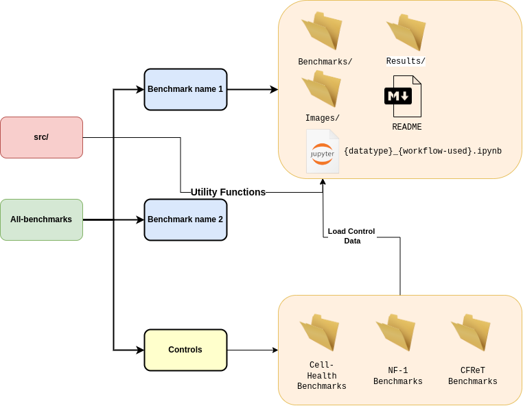

# CytoSnake-Benchmarks

Welcome to the `CytoSnake`'s Benchmark Repository, where we conduct version-controlled performance tracking of `CytoSnake`'s workflows.
This repository benchmarks various image-based profiling processing workflows.
We use this repo as a version control system to maintain transparency and track changes in performance.
Below we document our benchmarking process, including the datasets used, configuration files, performance metrics measured, and the selected workflow benchmarked Python notebooks.

## Structure


> CytoSnake-Benchmark repository structure

The image above provides an overview of the CytoSnake-Benchmark repository structure.
The central elements include the `src/` directory (red), housing utility functions for processing raw benchmark files and allowing those functions to be modular.
Adjacent is the `all-benchmarks/` directory (green), acting as a central repository for benchmarks conducted on specific datasets (blue).
Within each tested benchmark folder (yellow) (e.g inside  `benchmark name 1`)  a jupyter notebook is used to process the benchmark files and generates plots in the `image/` dir and benchmarking results in the `results/` dir.
Each folder features a detailed `README` specifying test contents and datasets used.

Below is a table that describes all of the currently available benchmarks inside the `all-benchmarks` directory:
| Directory Name              | Description                                                                                                                                                                                                                                                              |
| --------------------------- | ------------------------------------------------------------------------------------------------------------------------------------------------------------------------------------------------------------------------------------------------------------------------ |
| `cell-health-cp-cp_process` | Benchmarks the [`cp_process`](https://cytosnake.readthedocs.io/en/latest/workflows.html#cp-process) workflow using the cell-health [dataset](https://nih.figshare.com/articles/dataset/Cell_Health_-_Cell_Painting_Single_Cell_Profiles/9995672/5) cell profile features |

## Installation and Usage

### Installation

To get started, follow these steps:

1. Clone the benchmark repository to your local machine:

   ```bash
   git clone git@github.com:WayScience/CytoSnake-Benchmarks.git
   ```

2. To set up the required dependencies, create a `conda` environment by utilizing the `cytosnake_benchmarks.yaml` file.

   ```bash
   conda env create -f env.yaml
   ```

   > **Note**: If you already have `mamba` installed, you can substitute `conda` with `mamba`. It is advised to use `mamba` as it is widely recognized for being a [faster alternative](https://pythonspeed.com/articles/faster-conda-install/) to conda. If you haven't installed mamba yet, you can follow the installation instructions [here](https://mamba.readthedocs.io/en/latest/mamba-installation.html).

3. Then install the CytoSnake-Benchmark into the local python environment:

   ```bash
   pip install -e .
   ```

   This will give the notebooks to have access to all the functions within the `src/` directory.

## Creating a benchmark

To create a benchmark, follow these steps: First, create a folder in the `all-benchmarks/` directory with the structure `{data_type}_{features}_benchmarks/` for the file name.
Next, transfer all the necessary files into this folder, which should include the benchmark generated when executing CytoSnake's benchmarking mode.
Utilize notebooks to document and display all the raw code and figures generated during the benchmarking analysis.
Lastly, it's recommended to store all intermediate files and figures in the repository, allowing others to review and access them.
